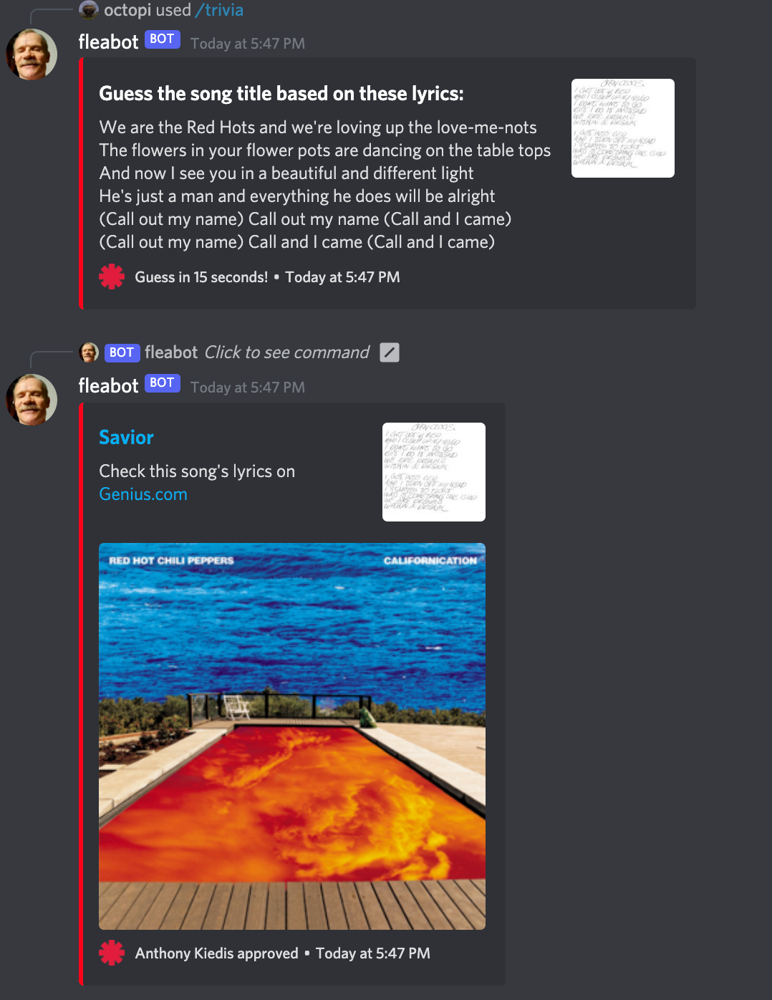
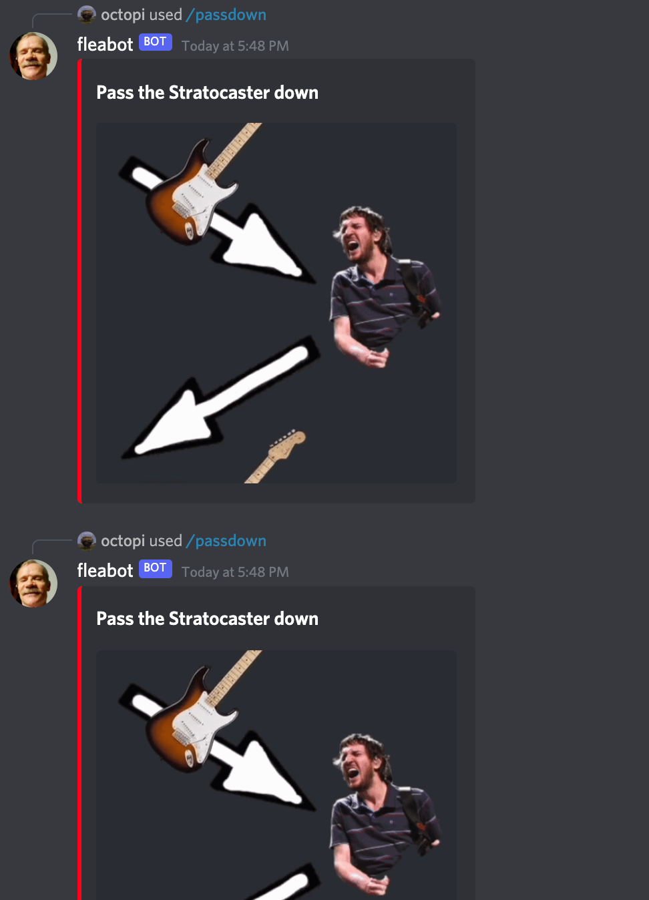

# FLEABOT
## A Discord bot dedicated to the Red  Hot Chili Peppers band.

Fleabot is a Discord bot dedicated to the chili peppers. You can give it commands to guess lyrics (pulled from a JSON with the band's lyrics in 278 songs, pulled from [genius.com](genius.com), guess what year some images were taken from (pulled from a JSON with getty images URL's), and [pass down the stratocaster](https://knowyourmeme.com/memes/pass-the-ball-down).

It's written in [DiscordJS](https://discord.js.org/) with some Python to pull lyrics from genius.com. It has command handling for the different commands which include:
- /trivia (handles the 278 lyrics songs with sections)
- /images (with 69 images)
- /passdown for passing down a Stratocaster.

# Features
## /trivia

- Used python to pull 278 songs from Genius.com (with **album artwork URL**, **lyrics**, **URL** and **title** and other things)
- Each song has sections (verse 1, chorus, etc...) so it pulls only a section for the embed message so you can have more than 2000 unique lyrics trivia.

## /images

- Pulled from a manually-picked JSON file from getty images from the band, initially with 69 images.
- Contains **URL**, **year**, **title**, **photographers** and **people**.

## /passdown

- passes down a stratocaster.

# Installation | How to use the Bot

 **1.** Install NodeJS
 **2.** Download this repo and unzip it   | or git clone it.
 **3.** Open CMD and Install all of the packages with **`npm install`**
  **4.** Make sure you put down the credentials **`clientId`**, **`guildId`** and the **`token`** keys in a  **`config.json`** file. More info [here](https://discordjs.guide/creating-your-bot/#creating-configuration-files).
 **5.** start the bot with **`node fleabot.js`**
